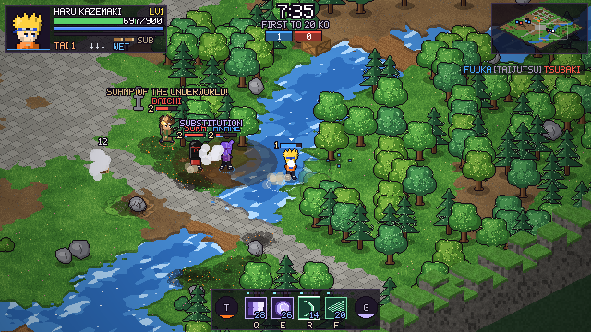
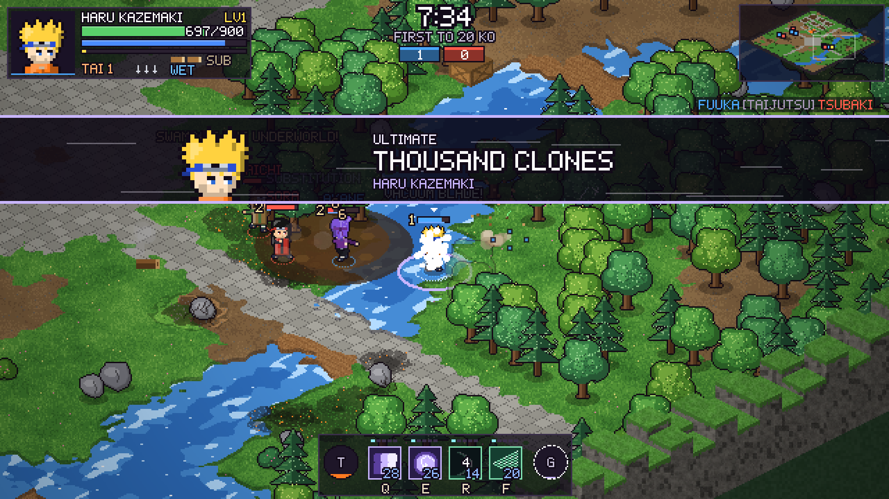

# Clash of Heaven

A 32-bit-style pixel-art **shinobi arena brawler** that runs in the browser. Up to 10 fighters battle in free-for-all or team matches on big, destructible isometric maps, using elemental jutsu, awakenings and ultimates. It's loosely inspired by classic ninja anime games.

Everything is procedurally generated in code: sprites, tiles, maps, icons, sound effects and music. There are no assets, dependencies or build step.




## Play

**Play online:** https://ilyxi.github.io/Clash-of-Heaven/

**Easiest:** download [`dist/clash-of-heaven.html`](dist/clash-of-heaven.html) (one self-contained file) and double-click it. It opens in your browser; no install or internet needed (the pixel fonts load when you're online, and the game falls back to a plain font offline). Chrome or Edge is recommended, especially with a controller.

From the source folder you can also open `index.html` directly, or serve it with any static server:

```sh
npx http-server .     # or: python3 -m http.server
```

Because the game is fully static, you can host it with **GitHub Pages**. In the repository settings, go to Pages and choose "Deploy from branch" with the root of your branch.

After changing the source, rebuild the single file with `node tools/bundle.js`.

## Features

- **Up to 10 fighters.** Play free-for-all or 2 to 5 teams against AI at four difficulties (Genin, Chunin, Jonin, Kage). You can also play Mixed difficulty, or spectate an all-AI match.
- **Two win modes.** In KO Race, the first player or team to N knock-outs wins. In Survival, fighters have limited lives and the last one standing wins. Both modes can have an optional time limit.
- **Four large arenas**, generated from a new seed every match:
  - Hidden Leaf Valley: a village, a river, forests and a training ground
  - Valley of Echoes: twin statues, a great river and a lake at sunset
  - Sunken Sand Ruins: a temple, colonnades and an oasis
  - Frostfang Peaks: a mountain shrine and a frozen lake
- **Destructible arenas.**
  - You can smash trees, rocks, crates, walls, pillars and whole houses one block at a time.
  - Explosions leave craters and scorch marks.
  - Fire spreads through grass, trees and wooden buildings.
  - Water leaves puddles, and lightning arcs through them and through rivers.
  - Earth jutsu raise temporary walls.
  - Explosive barrels blow up.
- **46 jutsu across six schools:** Fire, Water, Earth, Wind, Lightning and Shinobi arts. They include projectiles, beams, homing hounds, tornadoes, walls, swamps, leaps, clones, binds, reflect domes and more.
- **Summoning.**
  - **Storm Hawk:** ride a giant hawk over props and water and drop bombs below. Heavy dive-bombs and jumps off; the hawk soaks hits until its shield breaks.
  - **Great Toad:** crashes down on the aim point, then spits water shots at nearby enemies.
  - **Giant Serpent:** tears out of the ground and plows forward, launching everyone in its path.
- **Elemental system.** Fire beats Wind, Wind beats Lightning, Lightning beats Earth, Earth beats Water, and Water beats Fire. Advantage gives bonus damage and decides jutsu clashes. The elements also interact:
  - Soaked targets take extra lightning damage.
  - Water puts out fires.
  - Water jutsu cast in or next to water get a **Water Boost**: 35% bigger and 30% stronger.
  - Wind fans flames and throws enemy fireballs back.
- **6 awakenings:** Crimson Eye, Sage Mode, Beast Cloak, Eight Gates, Spirit Armor and Cursed Seal. Each is a timed transformation with unique buffs and visuals.
- **8 ultimates**, each with an anime-style cut-in: Heavenly Meteor, Chakra Cannon, Thunder Kirin, Great Tsunami, Tempest Shuriken, Thousand Clones, Inferno Dragon and Crimson Moon.
- **In-match progression.**
  - Your shinobi levels up from 1 to 10 from damage, KOs, assists and parries, gaining health and damage.
  - Every jutsu has its own mastery from Lv1 to Lv5. It gets stronger as you use it, and Lv5 unlocks a mastery perk.
  - Taijutsu mastery adds a 5th combo hit, then an air-chase follow-up, then an unblockable full-charge heavy.
- **Character creator.** Choose hair style and colors, skin, eyes, outfit, headband and extras. Then pick an elemental affinity, any four jutsu, an awakening and an ultimate. Your shinobi are saved in the browser.
- **Training Dojo.** Practice on dummies and a sparring partner, with meters that charge quickly.

## Controls

| Action | Keyboard / Mouse | PS5 controller | Xbox controller |
| --- | --- | --- | --- |
| Move | `WASD` / arrows | Left stick | Left stick |
| Aim | Mouse | Right stick (let go to auto-aim) | Right stick |
| Jump (press again for double jump) | `Space` | Cross | A |
| Attack (combo) | `LMB` / `J` | Square | X |
| Heavy / signature (hold to charge) | hold `LMB` / `K` | Triangle | Y |
| Dash / Substitution (when hit) | `Shift` | Circle | B |
| Block (tap just before a hit to parry) | `RMB` / `L` | R1 | RB |
| Lock on / switch target | `Z` or `MMB` / mouse wheel | R3 / D-pad left-right | RS / D-pad left-right |
| Jutsu 1–4 | `Q` `E` `R` `F` / `1`–`4` | Hold L2 + Cross / Circle / Square / Triangle | Hold LT + A / B / X / Y |
| Kunai (hold for a piercing shuriken) | `X` | R2 | RT |
| Charge chakra | hold `C` | hold L1 | hold LB |
| Awaken | `T` | L2 + R1 or D-pad up | LT + RB or D-pad up |
| Ultimate | `G` / `V` | L2 + R2 or D-pad down | LT + RT or D-pad down |
| Scoreboard / Pause / Mute | `Tab` / `Esc` / `M` | Touchpad / Options | Back / Start |

Controllers also drive every menu: D-pad or left stick to move, Cross/A to select, Circle/B to go back, L1/R1 to switch tabs. **Press any button after the page opens**: browsers only reveal a controller once it has been pressed. If a PS5 controller still isn't detected, close Steam (its controller layer can take over the pad) or try Chrome or Edge.

## Combat tips

- **Directional attacks (Brawlhalla-style).** Standing still gives a 4-hit string ending in a launcher; moving toward your target gives a lunging punch; moving away gives a retreating spin kick. Heavies are signature moves: neutral launcher, forward rocket punch, backward cyclone kick, and a dive kick in the air.
- **Jumping.** Double jump over low jutsu and props, attack in the air for a 3-hit air string, and jump right after a hit connects to chase an enemy into the air. The lower a fighter's health, the farther hits knock them.
- **Lock-on.** Lock a target to auto-aim every attack and technique at them; the camera frames you both and their health shows above your jutsu bar.
- **Combos and juggles.** Mash light attack for a string that ends in a launcher. You can keep a launched enemy in the air with more hits or jutsu. Enemies knocked into walls take bonus damage, and big hits smash right through.
- **Parry.** Tap block right before a hit lands. Melee attackers are stunned and projectiles fly back at their owner. Mashing block disables the parry.
- **Perfect dodge.** Dash through an attack at the last moment. You gain chakra and your next hit deals +30% damage.
- **Substitution.** Press dash while you're being comboed. You swap with a log and reappear behind your attacker. The gauge holds two uses.
- **Heavy attacks** break guards, and a fully charged heavy shatters any block.
- **Fight near rivers as a water user.** The boost makes Water Dragon, Crashing Wave and friends much larger, and water-affinity shinobi regain chakra faster there.

## Code layout

| File | Purpose |
| --- | --- |
| `js/util.js`, `js/font.js` | Math, color, iso-projection helpers and a 5×7 bitmap font |
| `js/audio.js`, `js/input.js` | Synthesized sound effects and music; keyboard, mouse and gamepad input |
| `js/sprites.js`, `js/art.js`, `js/icons.js` | Procedural pixel-art ninjas, map props and jutsu icons |
| `js/arena.js` | Tile map, generators for each theme, destruction, fire and water, collision, A* pathfinding |
| `js/combat.js`, `js/fighter.js` | Damage resolution, projectiles, hazards, and the fighter state machine |
| `js/data/*.js` | Elements, looks, the jutsu catalog, awakenings, ultimates and preset shinobi |
| `js/summons.js` | Summoning jutsu (hawk mount, toad, serpent) and their procedural art |
| `js/ai.js` | Bot brains that drive fighters through the same input struct as the player |
| `js/world.js` | Match rules, spawning, kills and assists, projectile clashes, camera |
| `js/render.js`, `js/drawfx.js`, `js/fx.js`, `js/hud.js` | Depth-sorted iso rendering, effects, particles and the HUD |
| `js/ui.js`, `js/main.js` | HTML menus and the main loop (fixed 60 Hz simulation) |
